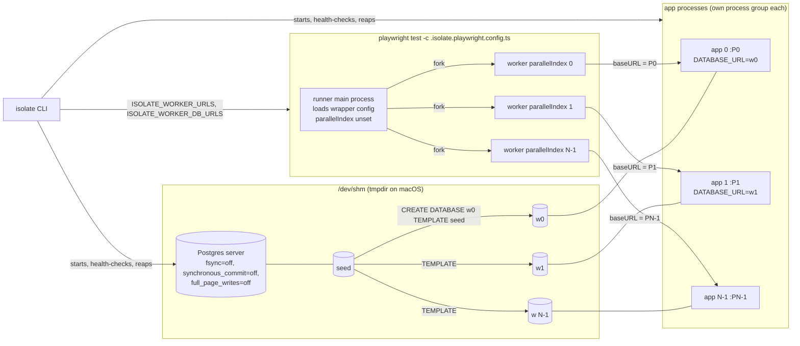
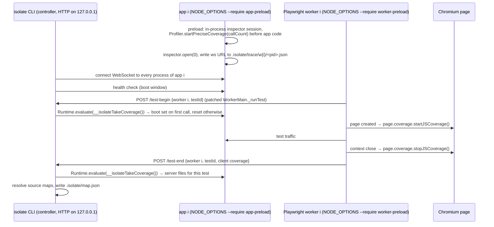

# PLAN

Status: v1. Items marked **[rev]** changed while drafting, after the F4 throwaway experiment; `PLAN_REVIEW.md` re-examines all of it.

## 1. The claims, and what would falsify them

**Claim A (isolation).** Most Playwright suites run with `workers: 1` because every worker would share one app process and one database. If each worker gets its own app process and its own copy of a seeded Postgres database, with no edits to the tests, then raising `workers` from 1 to N makes the test phase close to N times faster, bounded by cores, and adds no failures. It is falsified if (a) the median speedup at N = 4 across runnable repos is well below 4x (we call < 2x a failure of the claim and 2-3x "partial"), or (b) most repos show new deterministic failures under isolation, or (c) the per-worker plumbing cannot be done without test edits in most repos.

**Claim B (impact map).** If we record which server and client files each test executes, a change to file F only needs the tests that executed F, plus everything if F is boot-time code. It is falsified if mutating a file that the map ties to some tests breaks tests the map does not name (recall well below 1), or if the map is not stable across two identical runs (median per-test Jaccard < 0.9), or if the map selects nearly all tests for most files (then it is safe but useless).

## 2. Architecture

### Run mode (`isolate run`)



How a worker learns its `baseURL` **[rev, verified 2026-09-28, see LOG.md]**: Playwright forks each worker, and the worker's `WorkerMain` constructor sets `process.env.TEST_PARALLEL_INDEX` and only then loads the config file again inside the worker (`_loadIfNeeded` → `deserializeConfig`). `isolate` writes two files next to the repo's Playwright config (so every relative path in it resolves exactly as before):

- `.isolate.env.ts`: reads `TEST_PARALLEL_INDEX` and sets `process.env.BASE_URL` (and every other configured base-URL and database-URL variable) to worker *i*'s values.
- `.isolate.playwright.config.ts`: `import './.isolate.env'` first, then imports the repo's config, drops `webServer`, sets `workers`, sets `use.baseURL` at the top level and in every project, and appends the `isolate` reporter.

Because the environment is set before the repo's config and test files are evaluated in the worker, code that reads `process.env.BASE_URL` or `process.env.DATABASE_URL` directly (in the config, in fixtures, in tests that seed through Prisma) also gets worker *i*'s values. The spec's original mechanism (a `--require` preload reading `TEST_PARALLEL_INDEX` at worker startup) does **not** work: the variable is unset when the preload runs. The preload is still used, for a different job: tracing (below).

### Trace mode (`isolate trace`)



The first coverage take on each app covers everything executed before that worker's first test: that is the boot set. `global` is the set of files where a function other than the module's top-level scope ran at boot (config readers, pool creation, middleware that also served health checks). Files whose only boot-time execution was their module top-level (import side effects) are recorded as `bootLoaded`; see decision D-011.

## 3. Features in build order

The order is F1, F3, F4, F2, F6, F5, F7 **[rev]**. F4 is the sprint's load-bearing feature and was verified first as a throwaway; F1 and F3 are what F4 needs. F2 (detection) moved after F4 because a hand-written config is enough to build F1 to F4 against the fixture, and detection is easier to write once we know exactly what the other commands consume. F6 comes before F5 because the timing report is how we see that F5 saved time.

| # | Feature | Command | Acceptance e2e test (one sentence) |
|---|---|---|---|
| P1 | Fixture app | `just fixture-baseline`, `just fixture-collide` | At `workers: 1` the fixture suite passes; at `workers: 4` against one shared app it fails, both observed and recorded in LOG.md. |
| F1 | Postgres manager | `isolate db up --workers N` | `db up --workers 4` yields 4 reachable databases whose per-table row counts equal `seed`'s, and prints each copy time. |
| F3 | App process manager | `isolate app up --workers N` | `app up --workers 4` gives 4 healthy apps on 4 ports, each health endpoint reports its own `current_database()`, and SIGTERM (and SIGKILL) of the parent leaves no child process alive. |
| F4 | Playwright integration | `isolate run -- npx playwright test` | `isolate run --workers 4` passes every fixture test that failed in `fixture-collide`, and each worker's app log shows requests only from that worker. |
| F2 | Config and detection | `isolate init` | `init` on the fixture writes a config the other commands accept unedited, and `init` on a repo with a Redis dependency prints the unmanaged-service report and exits non-zero without `--allow-unmanaged`. |
| F6 | Timing report | end of every `run` | `.isolate/report.json` validates against the zod schema (`isolate report --check`), and restore + boot + tests + reruns + teardown add up to the measured wall time within 5%. |
| F5 | Snapshot and restore | `isolate snapshot`, `isolate run` | Two consecutive `run`s: the second prints a cache hit and a restore time, skips build, migrate and seed, and still passes. |
| F7 | Tracing and affected | `isolate trace`, `isolate affected --base <ref>` | On the fixture, editing the item-listing handler makes `affected` print only the item tests, and editing the database connection module makes it print `all`. |

Every acceptance test lives in `e2e/`, runs the built CLI against a real Postgres and a real Chromium, and asserts only on observable outcomes (exit codes, files, stdout, database contents, process table). `just e2e` runs them serially.

## 4. Module layout

```
src/cli.ts                 argv → command module (node:util parseArgs, no framework)
src/log.ts                 pino logger (stderr, human format) + JSON file log
src/paths.ts               .isolate/ layout
src/config/{schema,load}.ts zod schema, loader for isolate.config.ts (native TS import, Node >= 22.18)
src/db/                    F1: binaries, server lifecycle, template copies
src/app/                   F3: spawn in own process group, health checks, RSS sampling, reaper
src/playwright/            F4: wrapper config + env module generation, URL scan, reporter
src/init/                  F2: detection and unmanaged-service scan
src/report/                F6: report schema, table, flaky/deterministic reruns
src/snapshot/              F5: cache key, save, restore
src/trace/                 F7: app preload, worker preload, controller, source maps, map, affected
src/commands/<name>.ts     one file per CLI command, thin
e2e/*.test.ts              acceptance tests (node:test, compiled by tsc)
scripts/                   harvest, experiment runners, plotting
examples/fixture-app/      Phase 1
```

## 5. Experiment protocols

### Experiment A (isolation), as run

Per repo, in a fresh checkout, same machine, all runs recorded with CPU model, cores, RAM, OS, Node, Postgres, Playwright versions and "cloud sandbox: yes".

1. **Baseline**: the repo's own e2e command and config at its configured workers. Dependency install and browser setup excluded from timing. Cap 45 min ("exceeded cap").
2. **Setup fraction [rev]**: Playwright's JSON reporter drops hook and fixture steps (it keeps only `test.step`), so the `isolate` reporter (injected through the wrapper config) records per-test time in hooks and fixtures (`category` `hook` or `fixture`) vs the rest of the test. It runs in the isolated N = 1 run, which executes the same tests serially; the baseline is left uninstrumented so its wall time is untouched. We also report app boot time and runner overhead (wall time minus summed test time).
3. **Isolated runs**: N = 1, 2, 4, 8, skipping N > cores (this machine: 4 vCPU, so N = 8 is skipped for repos; on the fixture only, N = 8 is also run and labelled "oversubscribed" to show the curve past the core count). Each N twice, median reported, both runs listed. Warm vs cold: the first `isolate run` of a repo is cold (no snapshot); all measured runs are warm and say so; the cold run is reported separately.
4. **Failure classification**: any test failing under isolation that passed at baseline is re-run twice alone on a fresh copy of `seed`; deterministic failures are categorized (hardcoded URL, cross-test dependency, global state outside the DB, unmanaged service, shared auth state from setup projects/globalSetup **[rev]**, other).
5. **Memory**: peak RSS of all app process trees plus the Postgres tree at the largest N run.

Speedup is computed two ways and both reported **[rev]**: test phase only (Playwright's own wall time) and end-to-end (including app boot and restore), each against the baseline and against isolated N = 1.

### Experiment B (impact map), as run

1. Build the map twice on the same commit; per-test Jaccard of file sets; report median and min. Below 0.9 median → state that the map is unstable.
2. Mutations: up to 20 files present in at least one test's set, and up to 5 controls in no test's set and not global. **[rev]** Files are sampled uniformly at random with a fixed, reported seed from all eligible files (not hand-picked), stratified so that server and client files are both represented when both exist. Mutation: `throw new Error("isolate-mutant")` as the first statement of the first exported function; files without one are skipped and the skip is recorded. Suite run under isolation at the best N from Experiment A.
3. Score: P = tests whose set contains the file ("all" if global); recall = |F ∩ P| / |F| for non-empty F; selection ratio = |P| / total. **[rev]** Mutations where F is empty are counted and reported (they say the mutant was not detected by the suite at all, which is a property of the suite, not the map). Control failures are counted separately.
4. Every miss is investigated and categorized (lazy import, error path, coverage granularity, source-map failure, other).

## 6. Time budget and cut line

This sprint runs in one working session on a 4 vCPU cloud sandbox, not two weeks. Budget (wall clock):

| Phase | Budget |
|---|---|
| 0: plan, review, F4 verification | 45 min |
| 1: fixture app + baseline/collide | 45 min (parallel with F1/F3) |
| 2: F1-F7 | 3 h |
| 3: harvest | 45 min (parallel with Phase 2) |
| 4: Experiment A | 2 h |
| 5: Experiment B | 1 h |
| 6: results, docs, fresh-clone check | 1 h |

Cut order if time runs out: Experiment B on fewer repos → Experiment B on the fixture only → harvest capped at 50 → F5 snapshot. Never cut: the fixture demo, F1-F4, Experiment A, the honesty rules. Anything that could not run here goes to `HANDOFF.md` with exact commands.

## 7. Unverified assumptions

1. ~~Playwright re-evaluates the config inside each worker after `TEST_PARALLEL_INDEX` is set.~~ **Verified** for 1.56.1 (CJS and ESM packages). Other versions: checked per repo by the F4 acceptance on that repo (every worker's app log must show traffic).
2. Patching `WorkerMain.prototype._runTest` from a `--require` preload gives per-test begin/end hooks in the worker. **Verified** for 1.56.1; it is an internal API and is checked at runtime (trace refuses to run if the method is missing).
3. `CREATE DATABASE ... TEMPLATE` is fast (sub-second) for typical seeded app databases.
4. Real apps start N times on one machine without port or file conflicts beyond `PORT` and `DATABASE_URL`.
5. Real apps honor `PORT`/`DATABASE_URL` from the environment rather than a `.env` file (checked per run via `pg_stat_database` transaction counts per worker DB).
6. Node's in-process precise coverage started from a `--require` preload sees all app code, and bundled apps ship source maps good enough to map back to source files.
7. `page.coverage` (Chromium only) plus source maps resolves client code to source files.
8. The pre-installed Chromium (revision 1194, Playwright 1.56) works for repos pinned to nearby Playwright versions when exposed under their expected revision directory.
9. GitHub repository search is unavailable in this sandbox (verified: the API is scoped to this repository); awesome-selfhosted-data plus the seed list is a representative-enough candidate source (it is not: it is biased toward self-hosted apps; stated in the results).
10. A 4 vCPU cloud VM gives stable enough timings for medians of two runs (checked by reporting both runs).
