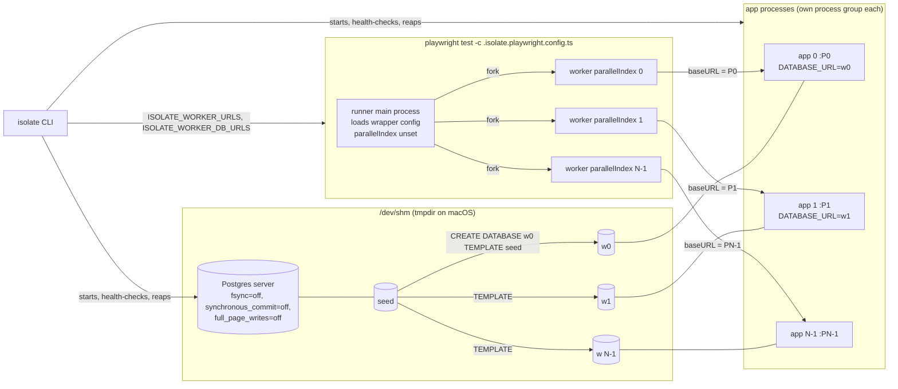
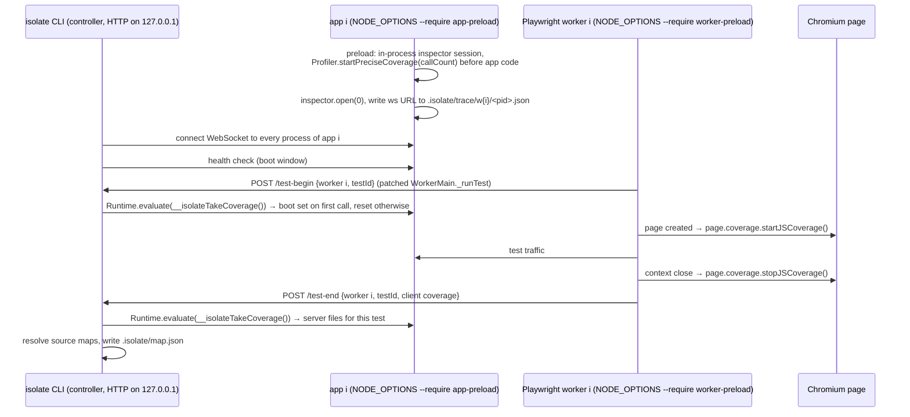

# PLAN

Status: v3, revised after `PLAN_REVIEW.md` (including its addendum). **[rev]** marks changes made while drafting (after the F4 throwaway) and after the review.

## 1. The claims, and what would falsify them

**Claim A (isolation).** Most Playwright suites run with `workers: 1` because every worker would share one app process and one database. If each worker gets its own app process and its own copy of a seeded Postgres database, with no edits to the tests, then raising `workers` from 1 to N makes the test phase close to N times faster, bounded by cores, and adds no failures. **[rev]** The verdict number is the median across runnable repos of test-phase(isolated N=1) / test-phase(isolated N=4), where the test phase is first test begin to last test end. The claim holds if that median is ≥ 3x with zero new deterministic failures in most repos. It is "partial" at 2-3x, and falsified below 2x, or if most repos show new deterministic failures under isolation, or if the per-worker plumbing needs test edits in most repos. Speedup against the repo's own baseline is reported as context, next to the harness effect (baseline@1 / isolated N=1).

**Claim B (impact map).** If we record which server and client files each test executes, a change to file F only needs the tests that executed F, plus everything if F is boot-time code. **[rev]** The headline is the fraction of live, non-global mutants whose failing tests were all predicted, with n and a 95% Clopper-Pearson interval. The claim holds if the interval's lower bound is ≥ 0.9. It is falsified if the lower bound is < 0.8, or if the map is unstable (median per-file Jaccard of selecting tests < 0.9 across two builds at different N), or if the median mutated file's time-weighted selection ratio is ≥ 0.8. In that last case the map is safe but useless.

**Scope [rev].** V1 manages Postgres and the app processes only. Redis, S3, queues, search engines and third-party APIs are out of scope. `isolate init` must detect them and refuse to proceed without `--allow-unmanaged`, and every report lists them. Per-test isolation (a fresh database per test) is also out of scope: a worker's tests share that worker's database, exactly as the serial baseline shares one.

## 2. Architecture

### Run mode (`isolate run`)



How a worker learns its `baseURL` **[rev, verified 2026-09-28, see LOG.md]**: Playwright forks each worker, and the worker's `WorkerMain` constructor sets `process.env.TEST_PARALLEL_INDEX` and only then loads the config file again inside the worker (`_loadIfNeeded` → `deserializeConfig`). `isolate` writes two files next to the repo's Playwright config (so every relative path in it resolves exactly as before):

- `.isolate.env.ts`: reads `TEST_PARALLEL_INDEX` and sets `process.env.BASE_URL` (and every other configured base-URL and database-URL variable) to worker *i*'s values.
- `.isolate.playwright.config.ts`: `import './.isolate.env'` first, then imports the repo's config, drops `webServer`, sets `workers`, sets `use.baseURL` at the top level and in every project, and appends the `isolate` reporter.

Because the environment is set before the repo's config and test files are evaluated in the worker, code that reads `process.env.BASE_URL` or `process.env.DATABASE_URL` directly (in the config, in fixtures, in tests that seed through Prisma) also gets worker *i*'s values. The spec's original mechanism (a `--require` preload reading `TEST_PARALLEL_INDEX` at worker startup) does **not** work: the variable is unset when the preload runs. The preload is still used, for a different job: tracing (below).

### Trace mode (`isolate trace`)



The first coverage take on each app covers everything executed before that worker's first test: that is the boot set. `global` is the set of files where a function other than the module's top-level scope ran at boot (config readers, pool creation, middleware that also served health checks). Files whose only boot-time execution was their module top-level (import side effects) are recorded as `bootLoaded`; see decision D-011.

## 3. Features in build order

The order is F1, F3, F4, F2, F6, F5, F7 **[rev]**. F4 is the sprint's load-bearing feature and was verified first as a throwaway; F1 and F3 are what F4 needs. F2 (detection) moved after F4 because a hand-written config is enough to build F1 to F4 against the fixture, and detection is easier to write once we know exactly what the other commands consume. F6 comes before F5 because the timing report is how we see that F5 saved time.

| # | Feature | Command | Acceptance e2e test (one sentence) |
|---|---|---|---|
| P1 | Fixture app | `just fixture-baseline`, `just fixture-collide` | At `workers: 1` the fixture suite passes; at `workers: 4` against one shared app it fails, both observed and recorded in LOG.md. |
| F1 | Postgres manager | `isolate db up --workers N` | `db up --workers 4` yields 4 reachable databases whose per-table row counts equal `seed`'s, and prints each copy time. |
| F3 | App process manager | `isolate app up --workers N` | `app up --workers 4` gives 4 healthy apps on 4 ports, each health endpoint reports its own `current_database()`, and SIGTERM (and SIGKILL) of the parent leaves no child process alive. |
| F4 | Playwright integration | `isolate run -- npx playwright test` | `isolate run --workers 4` passes every fixture test that failed in `fixture-collide`, and each worker's app log shows requests only from that worker. |
| F2 | Config and detection | `isolate init` | `init` on the fixture writes a config the other commands accept unedited, and `init` on a repo with a Redis dependency prints the unmanaged-service report and exits non-zero without `--allow-unmanaged`. |
| F6 | Timing report | end of every `run` | `.isolate/report.json` validates against the zod schema (`isolate report --check`), and restore + boot + tests + reruns + teardown add up to the measured wall time within 5%. |
| F5 | Snapshot and restore | `isolate snapshot`, `isolate run` | Two consecutive `run`s: the second prints a cache hit and a restore time, skips build, migrate and seed, and still passes. |
| F7 | Tracing and affected | `isolate trace`, `isolate affected --base <ref>` | On the fixture, editing the item-listing handler makes `affected` print only the item tests, and editing the database connection module makes it print `all`. |

Every acceptance test lives in `e2e/`, runs the built CLI against a real Postgres and a real Chromium, and asserts only on observable outcomes (exit codes, files, stdout, database contents, process table). `just e2e` runs them serially.

## 4. Module layout

```
src/cli.ts                 argv → command module (node:util parseArgs, no framework)
src/log.ts                 pino logger (stderr, human format) + JSON file log
src/paths.ts               .isolate/ layout
src/config/{schema,load}.ts zod schema, loader for isolate.config.ts (native TS import, Node >= 22.18)
src/db/                    F1: binaries, server lifecycle, template copies
src/app/                   F3: spawn in own process group, health checks, RSS sampling, reaper
src/playwright/            F4: wrapper config + env module generation, URL scan, reporter
src/init/                  F2: detection and unmanaged-service scan
src/report/                F6: report schema, table, flaky/deterministic reruns
src/snapshot/              F5: cache key, save, restore
src/trace/                 F7: app preload, worker preload, controller, source maps, map, affected
src/commands/<name>.ts     one file per CLI command, thin
e2e/*.test.ts              acceptance tests (node:test, compiled by tsc)
scripts/                   harvest, experiment runners, plotting
examples/fixture-app/      Phase 1
```

## 5. Experiment protocols

### Experiment A (isolation), as run [rev]

Per repo, in a fresh checkout, same machine, recording CPU model, cores, threads per core, RAM, OS, Node, Postgres and Playwright versions, and "cloud sandbox: yes".

1. **Build once, untimed.** Install, build, and browser setup happen before any timed run and are excluded from every arm.
2. **Baseline**: the repo's own config through a pass-through wrapper that only appends the timing reporter. `webServer`, `workers` and env stay as the repo has them. It runs against a fresh copy of `seed` on the same isolate-managed Postgres (same binary, same RAM directory, same settings). Two arms: baseline@configured (context) and baseline@1 (harness check). Cap 45 min ("exceeded cap").
3. **Setup fraction**: from the timing reporter in every arm: pre-test time (config load to first test: webServer, globalSetup, worker and browser start), test phase (first test begin to last test end), teardown, and per test the time in `hook`/`fixture` steps vs the rest.
4. **Isolated runs**: N = 1, 2, 4, 8, skipping N > cores (4 vCPU here, so no N = 8 on real repos). On the fixture, N = 8 is also run, labelled "oversubscribed". One discarded warm-up run per arm, then 3 rounds with the arm order rotated each round. Median and min-max reported; a 4th round is added when max/min > 1.10. All arms use `--retries=0`, `PLAYWRIGHT_HTML_OPEN=never` and the same `CI` value. Observed concurrency (distinct parallel indexes, max tests running at once) is recorded, and runs are labelled with it.
5. **Validity**: a timed run counts only if its per-test outcomes match the reference baseline's. Otherwise all arms are re-timed on the common passing subset. Routing is checked from outside the test process (per-worker database activity and per-app request counts); a run where a used worker's app saw no traffic is invalid.
6. **Failure classification**: a test is an isolation failure if it fails in ≥ 2 of 3 isolated N=4 rounds and passes in ≥ 2 of 3 baseline@1 rounds, whether or not it passes alone. Deterministic failures are categorized: hardcoded URL, cross-test dependency, global state outside the DB, unmanaged service, shared auth state (globalSetup / setup projects), timeout under load, other.
7. **Memory**: peak RSS of all app process trees plus the Postgres tree at the largest N.
8. **Reported speedups**: test-phase(N=1)/test-phase(N) per N (the verdict uses N = 4), the scheduling ceiling from the N = 1 run, per-test inflation, end-to-end time including app boot, and vs-baseline speedups next to the harness effect. The F5 cache effect (cold vs warm) is reported on its own and is never part of a speedup.

Real-repo Experiment A is limited to repos whose baseline@1 takes ≤ 5 min in this sandbox. Longer ones go to `HANDOFF.md` with exact commands.

### Experiment B (impact map), as run [rev]

1. **Stability**: build the map twice, at two different N (4 and 2). Per file, compute the Jaccard of the set of tests that select it, over files selected by < 50% of tests. Report median and min. Per-test Jaccard is reported too, for comparison with the spec.
2. **Targets**: sample from the full source set (`git ls-files` minus tests and generated files), with a fixed, reported seed, stratified by map status: in ≥ 1 test set / bootLoaded only / global / absent. Aim for 20 in-map files and 5 absent-file controls.
3. **Mutants**: (a) throw: `throw new Error("isolate-mutant")` as the first statement of the first exported function (the spec's). On the fixture only, plus real repos if time allows, also (b) top-level: change a module-scope literal, and (c) wrong-value: an early return of a plausible wrong value. Liveness check: the mutant marker or changed literal must appear in the build output that is served. Non-live mutants are reported, not scored.
4. **Runs**: two unmutated reference runs at the best N from Experiment A; any test failing there is excluded from every F. Each mutant runs the full suite under isolation at that N.
5. **Score**: P = tests whose map contains the file (or all, if global). Recall = |F ∩ P| / |F| when F is non-empty. The count and time-weighted selection ratios are |P| / total and Σ duration(P) / Σ duration(all). Scored under both global policies (function-level default and `--strict`). Headline: the fraction of live, non-global mutants with zero misses, with a Clopper-Pearson 95% interval. Empty-F mutants are split into "mutated function never executed" and "executed, no test failed". Live controls that fail are misses of a different kind.
6. **Every miss is investigated** and categorized: lazy import, error path, coverage granularity, source-map failure, cross-test state through the DB, top-level code, other.

## 6. Time budget, checkpoints and cut line [rev]

This sprint runs in one working session on a 4 vCPU cloud sandbox, not two weeks. Rate-limit resumes stop after 12:00 UTC, so everything that matters must be committed before then. Checkpoints (UTC):

| By | What must be true |
|---|---|
| 08:45 | Plan v3, review, F4 spike committed. Fixture, F1/F3, F4/F6, harvest and the real-repo scout running in parallel. |
| 10:00 | Fixture accepted; F1, F3, F4 accepted. Scout gate: ≥ 2 real repos green at baseline, else re-scope to onboarding. |
| 11:00 | F6 accepted; Experiment A on the fixture done; harvest committed. |
| 11:45 | Experiment A on ≥ 1 real repo; partial RESULTS.md, HANDOFF.md and raw results committed. |
| after | F2, F5, F7, Experiment B, more repos, final docs, fresh-clone check. |

Cut order if time runs out: F5 snapshot → F2 auto-detection (keep the unmanaged scan) → F7 client coverage (server-only map) → Experiment B on fewer repos → Experiment B on the fixture only → the N = 2 arm. Never cut: the fixture demo, F1, F3, F4, the minimal F6, Experiment A on ≥ 1 real repo, the honesty rules. Anything that could not run here goes to `HANDOFF.md` with exact commands.

## 7. Unverified assumptions

1. ~~Playwright re-evaluates the config inside each worker after `TEST_PARALLEL_INDEX` is set.~~ **Verified** for 1.56.1 (CJS and ESM packages). Other versions: checked per repo by the F4 acceptance on that repo (every worker's app log must show traffic).
2. Patching `WorkerMain.prototype._runTest` from a `--require` preload gives per-test begin/end hooks in the worker. **Verified** for 1.56.1; it is an internal API and is checked at runtime (trace refuses to run if the method is missing).
3. `CREATE DATABASE ... TEMPLATE` is fast (sub-second) for typical seeded app databases.
4. Real apps start N times on one machine without port or file conflicts beyond `PORT` and `DATABASE_URL`.
5. Real apps honor `PORT`/`DATABASE_URL` from the environment rather than a `.env` file (checked per run via `pg_stat_database` transaction counts per worker DB).
6. Node's in-process precise coverage started from a `--require` preload sees all app code, and bundled apps ship source maps good enough to map back to source files.
7. `page.coverage` (Chromium only) plus source maps resolves client code to source files.
8. The pre-installed Chromium (revision 1194, Playwright 1.56) works for repos pinned to nearby Playwright versions when exposed under their expected revision directory.
9. GitHub repository search is unavailable in this sandbox (verified: the API is scoped to this repository); awesome-selfhosted-data plus the seed list is a representative-enough candidate source (it is not: it is biased toward self-hosted apps; stated in the results).
10. **[rev]** A 4 vCPU cloud VM gives stable enough timings: checked per arm by max/min over ≥ 3 rounds (≤ 1.10, else another round) and by recording CPU steal per run.
11. **[rev]** Real apps' auth survives isolation: sessions created by `globalSetup` or setup projects live in one worker's database. Expected to fail for database-backed sessions; measured, not assumed.

## 8. Honesty rules [rev]

1. Every number in RESULTS.md cites a committed raw file under `data/results/<repo>/` and the exact command that produced it.
2. Every attempted repo is listed with its outcome and exclusion reason, with the funnel: sources → scanned → qualified → baseline green → measured.
3. The verdict rules in §1 were fixed in commit e5c5361 (08:23 UTC) before any data. Any change is timestamped in LOG.md with the reason.
4. Any change to a repo file makes that result "with modifications" and its diff is committed next to it.
5. A run with invalid routing (a used worker database without activity) or "too many clients" in the Postgres log is excluded and listed as excluded.
6. Timed runs happen with no subagent active. Load average at start is recorded, and the run is redone if it is above 1.0.
7. Numbers worse than predicted are reported the same way as numbers that are better.
